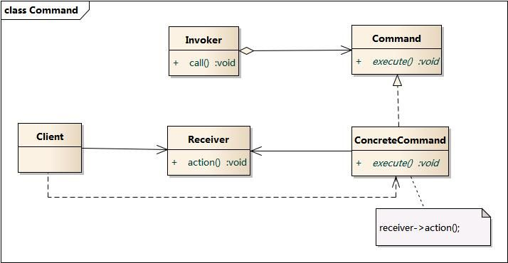

# Design_patterns

## 单例模式Singleton Pattern

### 描述

- 保证某个类只有一个实例

- 提供一个访问该实例的全局变量
- 仅首次请求单例对象时允许初始化

### 方法

- 默认构造设为私有
- 静态构造函数

### 使用场景

- 资源管理器：SoundManager，ParticeManager
- 创建线程池
- 多线程的单例模式，线程锁和双重检测

~~~cpp
if()->clock->if()->new->unclock
~~~

### 优缺点

- 优点：
  - 提供了堆唯一实例的受控访问
  - 节约资源
  - 可以拓展为固定数量实例的模式，防止访问过多
- 缺点：
  - 单例模式不是抽象的，可拓展性差
  - 单例职责重，耦合度高，一定程度上违背了单一职责

### UE4中的单例模式

- GameInstance：整个游戏只能存在一个该类，且全游戏可访问
- Subsystem：一套可以定义自动实例化和释放的类的框架。

## 简单工厂模式Simple Factory Pattern

### 描述

- 又称静态工厂的方法
- 一般使用静态方法，根据参数不同创建不同的类

### 方法

- 创建抽象产品类
- 创建具体产品类，继承自抽象产品类
- 创建工厂类，
- 使用静态方法，根据参数不同创建不同的类

### 使用场景

- 负责创建的对象比较少，不会造成工厂方法中逻辑复杂
- 客户端只知道传入工厂类的参数

### 优缺点

- 优点
  - 将创建实例和使用实例分开，解耦合
  - 初始化在工厂里，代码容易维护
- 缺点
  - 工厂集中了产品创建的所有逻辑
  - 违背“开放—关闭原则”，添加新产品要修改工厂类

### UE4中的简单工厂模式

- NewObject():是UObject工厂模式。给定外部对象和类，创建自己的新实例。

## 工厂方法模式 Factory Method Pattern

### 描述

- 又称工厂模式
- 工厂父类负责创建产品对象的公共接口，工厂子类负责生产具体的产品对象

### 方法

- 创建抽象产品
- 创建具体产品
- 创建抽象工厂
- 创建具体工厂，定义具体产品类的创建方法
- 通过调用具体工厂类方法，从二创建具体产品实例

### 使用场景

- 当一个类不知道他所需要的对象的类，使用者不需要直到具体产品类的类名，只需要知道所对应的工厂即可
- 当一个类希望通过子类指定创建对象时，由子类创建具体产品。

### 优缺点

- 优点
  - 将创建实例工作与使用实例的工作分开，实现了解耦合
  - 用户只需关心所需产品对应的工厂，无需关心创建细节，甚至无需知道具体产品类的类名
  - 加入新产品时，无需修改抽象工厂和抽象产品类，只需要添加一个具体的工厂和产品就行，这样更符合开闭原则
- 缺点
  - 在添加新产品，需要编写具体的产品类和工厂类，一定层度上增加了系统复杂性
  - 引入抽象层，理解难
  - 一个具体的工厂中鞥创建一种具体的产品

### UE4中的工厂方法

- 继承UObject自定义资产类
- 继承UFactory的工厂类
  - SupportedClass指定资产类
  - FactoryCreateNew重载资产类实例化

## 抽象工厂模式Abstract Factory Pattern

### 描述

- 提供一个创建一系列相关或相互依赖对象的接口，而无需指定他们具体的类，具体的工厂负责生产具体的产品实例
- 每个抽象工厂可以生产多种产品

### 方法

- 创建抽象产品族类，定义产品公共接口

- 创建抽象产品类
- 创建具体产品
- 创建抽象工厂类
- 创建工厂类，定义具体产品的创建方法
- 通过调用具体工厂类的方法，从而创建不同具体产品类的实例

### 使用场景

- 系统不该依赖于产品实例创建，组合，表达的细节
- 系统有多个产品族，每次只使用一个
- 属于同一产品族的产品将一起使用
- 系统提供一个产品类的库，所有产品以同样的接口出现，从而客户端不依赖于实现

- 例子：
  - 敌人生成：不同区域用不同工厂生产不同敌人
  - 游戏难度：难度不同生成不同东西
  - AI战术：根据地形，敌人等选择战术
  - 多语言：用户改变语言环境，会改变文字显示，音效，图片等
  - 皮肤更换，资源管理：选择不同图片影响图片显示
  - 屏幕适配：对高中低分辨率显示不同的资源

### 优缺点

- 优点：
  - 隔离了具体类的生成，调用者不需知道什么被创建。
  - 所有具体工厂都实现了抽象工厂定义的公共接口，因此只需要改变具体工厂的实例，就可以在某种程度上改变整个软件的行为。实现高内聚低耦合
  - 增加新的具体工厂和具体类很方便，符合开闭原则
- 缺点：
  - 在添加新的产品对象时，难以扩展抽象工厂来生产新的种类产品，需要对抽象产品类扩展。将修改抽象类的所有子类
  - 开闭原则的倾斜性：增加工厂和产品族容易，增加新的产品等级结构麻烦

## 三种工厂小结

假设有 骷髅士兵，骷髅弓箭手，哥布林士兵，哥布林弓箭手四种怪物

- 简单工厂模式：一个工厂有四个方法分别用于创建 四类怪物
- 工厂方法模式：创建四个工厂分别创建四类怪物
- 抽象工厂模式：两个工厂，一个用于生产哥布林怪物，一个用于产生骷髅怪物；个产品类，一个用于生产士兵怪物，一个用于生产弓箭手怪物

## 建造者模式Builder Pattern

### 描述

- 将复杂的对象的构建和表示分离，是的同样的构建可以创造不同的表示
- 客户端知道建造者即可返回一个完整的复杂对象

### 方法

- Builder抽象建造者：包含两个接口
  - 创建复杂对象的各个部件
  - 返回生成的复杂对象
- ConcreateBuilder：具体化BUilder
- Product：复杂对象，包含多个组成部件
- Director：指挥者：安排Builder构建装配方法

### 使用场景

- 需要生成的对象有复杂的内部结构，包含多个成员属性
- 对象属性相互依赖，有顺序要求
- 对象的创建过程独立于创建该对象的类，将窗机爱你过程封装到指挥者类而非建造者类中
- 隔离复杂对象的创建和使用，使得相同创建过程可以创建不同产品
- 示例：
  - 不同门派的角色生成
  -  不同地图生成
  - 武器组装

### 优缺点

- 优点
  - 客户端不必知道产品内部细节，将产品和产品的建造过程解耦合，相同创建过程可以创建不同的产品对象
  - 用不同的建造者可以产生不同的产品对象
  - 将复杂产品的创建过程分布在不同方法中，更加容易控制
  - 指挥者针对抽象建造者，添加新的建造和不需要修改源代码，符合开闭原则
- 缺点
  - 建造者生产的产品一般有较多的共同点

## 命令模式Command Pattern

### 描述

- 将一个请求封装为一个对象，从而我们能用不同请求对客户进行参数化
- 又称动作模式或事物模式

### 方法

- 客户端Client：发起命令
- 调用者Invoker：管理命令
- 抽象命令Command：命令接口
- 具体命令ConcreateCommand：具体命令
- 接收者Receiver：任务的实际执行者

### 使用场景

- 系统需要将请求调者和请求接收者解耦，使得调用者和接收者不直接交互
- 系统需要在不同时间指定请求，将请求队列和执行请求
- 系统需要将一组操作组合在一起，及支持宏命令
- 示例：
  - 按键，快捷键映射，玩家输入
  - 撤销，恢复，维护命令列表
  - 新手引导

### 优缺点

- 优点：
  - 解耦合
  - 新的命令容易加到系统中
  - 比较容易设计一个命令队列和宏命令
  - 方便实现对请求的undo和redo
- 缺点：
  - 导致某些系统有过多的具体命令类

## 原型模式

### 描述

- 使用原型实例指定创建对象的种类，通过拷贝创建新的对象。如影分身之术，光剑分化
- 是一种创建型设计模式，允许一个对象在创建另一个可指定对象，无需知道细节
- 将一个原型对象传给要创建的对象，这个要创建的对象通过请求原型对象拷贝自己来实施创建对象

### 方法

- Prototype（抽象原型类）：声明克隆方法的接口，是具体原型的父类
- ConcretePrototype（具体原型类）：在抽象原型中声明克隆方法，在克隆方法中返回自己的克隆对象
- Client（客户类）：让一个原型方对象克隆自己创建一个新的对象。只需要创建一个自身，然后调用克隆方法就可以生成多个相同对象

### 使用场景

- 资源复用优化
- 初始化需要消耗很多资源
- 实例化需要繁琐的准备步骤
- 需要方便复制

### 优缺点

- 优点
  - 客户端针对Prototype编程，用户可以根据需要选择具体的原型类，增加删除原型类很方便，扩展性较好
  - 简化创建过程
  - 可以辅助实现撤销操作，恢复到历史状态
- 缺点
  - 需要为每一个类配备一个克隆方法，而且该克隆方法位于一个类的内部，改造已有类的时候需要修改源码，违背开闭原则
  - 为了实现深复制，当对象存在多重嵌套引用，每一层都需要支持深复制，实现麻烦

## 观察者模式

### 描述

一种一对多关系，每当一个对象状态发生改变，其相关依赖对象皆得到通知并自动更新

### 方法

- 抽象目标
  - 被观察的对象，每个对象都可能有n个观察者。抽象目标提供一个接口，可以增加删除观察者数量

- 具体目标
  - 具体的被观察对象，当内部状态发生变化回通知观察者，同时向观察者提供用于查询状态的接口
- 抽象观察者
  - 为所有的具体的观察者定义一个接口，在得到通知是更新自己
- 具体观察者
  - 持有具体目标的引用，实现抽象观察者所要求的更新接口

### 使用场景

- 两个类有依赖关系
- 一个模型的两部分具有依赖关系，可拆分成两个类
- 一个类需要通知其他对象，且不知道这些对象是谁
- 触发链关系，A通知B，B通知C。。。
- 示例
  - 网站发给多用户某些信息
  - 游戏通知，队伍副本进度
  - MVC架构模式——多个view注册监听model

### 优缺点

- 优点
  - 观察者迷失实现了表示层和数据逻辑层分离，定义了稳定的消息传递机制
  - 在观察者和被观察者之间形成抽象耦合
  - 支持广播通道
  - 符合开闭原则
- 缺点
  - 观察者（直接，间接）很多的话，通知很慢
  - 观察者之间如果有循环依赖，回造成系统崩溃
  - 观察者只知道变化，不知道变化的原因
  - 订阅后如果不取消订阅容易内存泄漏

### UE4中的观察者模式

UE4的委托代理，事件调度器，按键事件绑定，碰撞事件绑定

## 状态模式State Pattern

### 描述

- 允许一个对象在其内部状态改变时改变它的行为

- 有限状态机（FSMs）

  - 拥有状态机所有可能状态的集合

  - 状态机同时只能在一个状态

  - 一连串的输入或事件被发送给状态机

  - 每个状态都有一系列的转移，每个转移与输入和另一状态相关

- 并发状态机：有些状态需要并行执行

- 层次状态机：状态中嵌套子状态，可以使用继承实现或者状态栈来实现

- 下推自动机：

  - 用栈来存储一系列状态。有限状态机有一个指向状态的指针，下推自动机有一栈指针
  - 新状态压入栈中，“当前的”状态总是在栈顶
  - 弹出最上面的状态，这个状态会被销毁，它下面的状态成为新状态。

### 方法

- 环境类 Context，用于改变状态
- 抽象状态类 State
- 具体状态类 ConcreteState

### 使用场景

- 对象的行为依赖于它的状态（属性）并且可以根据它的状态改变而改变它的相关行为。
- 代码中包含大量与对象状态有关的条件语句，这些条件语句的出现，会导致代码的可维护性和灵活性变差，不能方便地增加和删除状态，使客户类与类库之间的耦合增强。在这些条件语句中包含了对象的行为，而且这些条件对应于对象的各种状态。
- 示例
  - OA办公系统中多种状态：尚未办理；正在办理；正在批示；正在审核
  - TCP 连接状态
  - 动画系统、AI行为树
  - UI界面管理

### 优缺点

- 优点
  - 封装了转换规则。
  - 枚举可能的状态。
  - 将所有与某个状态有关的行为放到一个类中，并且可以方便地增加新的状态，只需要改变对象状态即可改变对象的行为。
  - 允许状态转换逻辑与状态对象合成一体，而不是某一个巨大的条件语句块。
  - 可以让多个环境对象共享一个状态对象，从而减少系统中对象的个数。
- 缺点
  - 状态模式的使用必然会增加系统类和对象的个数。
  - 状态模式的结构与实现都较为复杂，如果使用不当将导致程序结构和代码的混乱。
  - 状态模式对“开闭原则”的支持并不太好，对于可以切换状态的状态模式，增加新的状态类需要修改那些负责状态转换的源代码，否则无法切换到新增状态；而且修改某个状态类的行为也需修改对应类的源代码。

### UE4中的状态模式

- 有限状态机：动画状态机系统、行为树系统
- 并发状态机：画状态机，经常分为上半身动画与下半身动画融合
- 下推自动机：UI界面管理

## 享元模式

### 描述

- 实现大量细粒度对象的多次复用
- 享元类可以有多个对象
- 享元类包括**内部**不随外界变化而变化的共享部分，和**外部**随外界变化而变化的不能共享部分

### 方法

- **Flyweight（抽象享元类）**
  一个接口或抽象类，声明了具体享元类的公共方法。
- **ConcreteFlyweight（具体享元类）**
  实现了抽象享元类，其实例称为享元对象。
- **UnsharedConcreteFlyweight（非共享具体享元类）**
  并不是所有的抽象享元类的子类都需要被共享，不能被共享的子类可设计为非共享具体享元类。
- **FlyweightFactory（享元工厂类）**
  用于创建并管理享元对象，一般设计为一个存储“Key-Value”键值对的集合。其作用就在于：提供一个用于存储享元对象的**享元池**，当用户需要对象时，首先从享元池中获取，如果享元池中不存在，那么则创建一个新的享元对象返回给用户，并在享元池中保存该新增对象

### 使用场景

- 需要生成大量相似的对象，这将占用大量内存
- 对象中包含能在多个对象之间共享的重复状态
- 实例：
  - 场景的植被，子弹，他们的贴图网格体一样，transform不一样
- 对象池也能重复使用，但每次都是独占使用，享元池是共享使用

### 优缺点

- 优点：
  - 相同的东西只保存一份，减少内存占用
  - 外部状态可以用于适应环境，不会影响内部状态
- 缺点：
  - 需要将系统分为内部外部，程序复杂
  - 读取外部状态的时间变长

## 外观模式Facade Pattern

### 描述

- 将一个系统二次封装，为子系统的接口提供一个一致的界面

## 方法

- 外观角色：客户端调用的角色方法
- 子系统角色：内部系统，功能实现部分，外观角色是他的接口

## 使用场景

- 想为复杂的子系统提供一个统一的接口

- 客户端和多个子系统之间存在很大的依赖性，外观模式解耦合
- 在层次化结构中，可以使用外观模式定义系统中每一层的入口，层与层之间不直接产生联系

## 优缺点

- 优点
  - 降低了客户端和子类系统的耦合
  - 简化了接口，方便客户端使用
  - 降低编译的依赖性，简化系统在不同平台的移植过程
- 缺点
  - 新增子系统时需要修改子系统和外观类两部分代码，违背开闭原则
  - 减少了客户端访问子类系统的灵活可变性

## UE中的实例

- UKismet库
